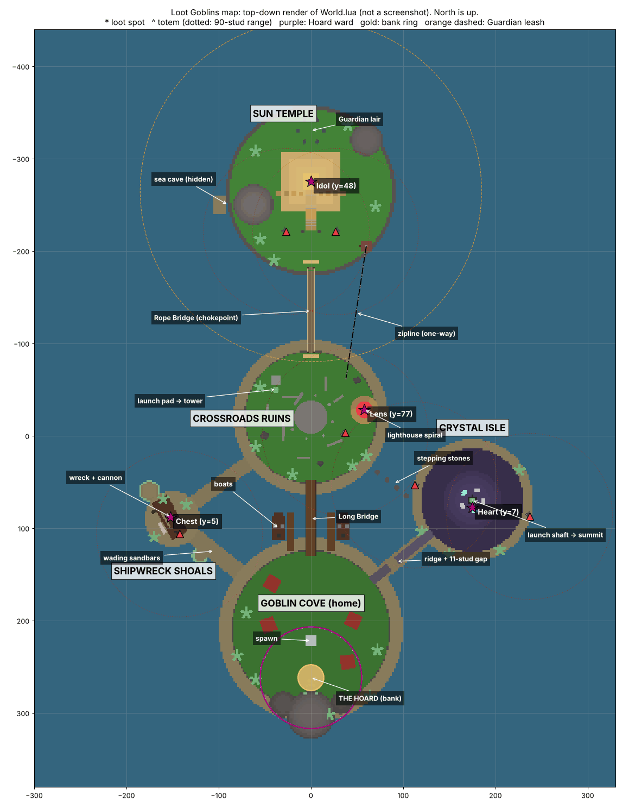

# Report: Vertical slice foundation

| | |
| --- | --- |
| Date | 2026-10-06 |
| Request | Ninety's "first substantial playable foundation" prompt, run by Enrik |
| Agent | Claude Code (cloud session, Linux container, no Roblox Studio) |
| Branch | `claude/quirky-shannon-23gez5`, from `origin/main` at `8f9a888` |
| Pull request | See the PR opened from this branch (number in the PR thread) |
| Merge status | **Not merged.** Waiting for a Studio playtest and explicit approval. |

## 1. Summary

The prototype went from "one idol, one guardian, two flat islands" to a timed **raid** on a five-zone archipelago:

- **Four** pieces of loot, each causing its own **trouble** when stolen.
- A shared **Heat** meter that escalates how the world hunts carriers.
- A kinematic **Guardian** and **totems** that only target carriers.
- Sword, grapple and throw built around possession.
- Soul Unbound reworked into **Poltergoblin**, an extraction decision rather than a free escape.
- A **HUD** that says what to do and where everything is.

**This session had no Roblox Studio and no Studio MCP** (Linux cloud container). Nothing here has been played in Roblox. Section 7 lists what was verified instead: static checks, type checking against the Roblox API, and a headless run of the real game scripts with faked engine pieces. Section 8 lists what is unverified, and section 10 is the human checklist.

*Top-down render of `World.lua`'s output, made by running the world builder headlessly. It is not an in-game screenshot.*

## 2. What I chose to build

| Pillar | What exists now |
| --- | --- |
| Loop | 5-minute raids, 12 s intermission. The most gold banked wins. Loot not banked at the buzzer is lost. |
| Loot | Lens (3g), Chest (4g), Crystal Heart (5g), Golden Idol (10g). Each has a carry speed, a heat cost and a trouble. Banked loot respawns. |
| Trouble | Bell reveal (Lens), cannon barrage (Chest), cave-in (Heart), Guardian plus rolling boulder (Idol) |
| Heat | CALM → ALERT (carriers revealed, totems fire) → HUNTED (Guardian hunts near the temple) → FRENZY (Guardian hunts anywhere) |
| Interference | Sword knocks loot loose, grapple steals with line of sight, Q throws, steal immunity stops ping-pong |
| Poltergoblin | Yone's E mechanics with goblin-ghost presentation. Loot rides the tether back, the tether has a length, the body can be struck, the Hoard's ward repels spirits. |
| Map | Goblin Cove (home and Hoard), Crossroads Ruins (lighthouse), Sun Temple, Crystal Isle, Shipwreck Shoals |
| Traversal | Two boats, a one-way zipline, launch pads, wading sandbars, stepping stones, a ridge shortcut with a carrier-proof gap |
| Readability | Light pillars and always-visible tags on loot, loot board, Heat bar, raid timer, objective line, ability slots, Hoard waypoint, event feed, banners, sounds, screen tint, help panel |

Deliberately **not** built: shops, progression, persistence, teams, NPC crowds, pathfinding, custom animations, uploaded assets, more loot types, gamepad and touch ability buttons.

## 3. Important design decisions and why

1. **Timed raids instead of single-idol rounds.** Test 001 reset the world after every bank, so "decide to go again" never happened. Several loot items, respawns and a shared clock make "bank it, then risk another run while Heat is high" the core decision. It also gives a clear winner and a natural reset.
2. **Threats only target carriers.** This is the thesis rule: Heat follows the item. When loot changes hands, the danger changes hands. Empty-handed players are free to hunt carriers, so the social game (rob the carrier, wait at the bridge, camp the Hoard) emerges.
3. **Carriers can't swing; one hit knocks loot loose.** Carrying is a vulnerable role. A carrier who wants to fight must throw the loot first, a visible, risky choice. Possession stays contested instead of whoever carries just winning duels.
4. **Line of sight for grapple.** Test 001's grapple was a 70-stud instant steal through walls. With LOS, the map matters: ruins, tunnels and the ship hull are real cover.
5. **Steal immunity (1.5 s).** Without it, two players with sword and grapple could ping-pong possession every frame.
6. **Throwing (Q replaces drop).** It enables passes, tossing loot over gaps you then jump empty-handed, and throwing into the Hoard (it banks for the thrower). It is a skill tool that never gets loot home by itself.
7. **Kinematic Guardian.** Pathfinding on a complex map is fragile, and the old `MoveTo` Guardian pushed the idol off the map (known bug). The new one walks over terrain and walkable parts, wades through the sea, and has no collisions. Tunnels become safe routes it can't follow, which adds route decisions.
8. **Guardian leash until FRENZY.** Escaping the temple's area is a real goal ("make it past the rope bridge"). At FRENZY the leash comes off, which is the late-raid escalation.
9. **Sword on spawn, pedestal removed.** It removes a step for new players and frees the E key for Poltergoblin and prompts.
10. **Faster base movement (20, was 16)** with per-item carry speeds (13–16). The map is bigger, so traversal needed to feel quicker. The gap between empty players and carriers is what makes chases.
11. **Floating loot and auto-return.** Dropped loot floats in the sea, and loot out of bounds or idle for 45 s returns to its spot. No raid can be bricked by lost loot.
12. **Sounds from built-in client files only**, pitched for variety. No uploaded audio means no asset permissions and no "failed to load" console errors.

## 4. Architecture changes

The single 961-line server script became plain ModuleScripts, each with one job and a header comment explaining its rules:

| Module | Lines | Job |
| --- | --- | --- |
| `Main.server.lua` | 187 | Boot, wiring, player lifecycle, feed text, the one Heartbeat |
| `World.lua` | 1203 | Terrain and parts, named `refs` for gameplay |
| `Loot.lua` | 648 | Items, possession, throw, knock loose, bank, respawn, recovery |
| `Threats.lua` | 824 | Guardian, totems, projectiles, trouble, carrier reveal |
| `Poltergoblin.lua` | 403 | The spirit ability |
| `Combat.lua` | 221 | Sword and grapple |
| `Raid.lua` | 167 | Phases, scoring, winners, reset |
| `Boats.lua` | 123 | Kinematic boats with land checks |
| `Util.lua`, `Net.lua`, `Movement.lua`, `Heat.lua` | 52–96 | Helpers, remotes and broadcast, WalkSpeed, Heat |
| client `Main`, `Hud`, `Effects` | 496 / 726 / 217 | Input and client movement toys, HUD, local effects |
| `Config.lua` | 183 | All tuning, including the loot table and heat tiers |

- No framework. Modules call each other directly, and a 15-line `Util.signal()` announces loot events.
- Require order has no cycles. Main injects the one back-reference (`Loot.canBank`).
- The authority boundaries are unchanged: the server owns all state and every hit, and clients send intent.
- Replicated state lives in attributes. Events use one `GameEvent` channel.
- Ninety's prompt explicitly allowed this decomposition. `AGENTS.md` asks for human approval of new architecture patterns, so reviewers should confirm they're happy with it.

## 5. Map and level design

North is -Z. Five zones in a ring, about 430 × 670 studs. The old map was two flat islands 300 studs apart on a 900-stud sheet of solid "water".

- **Goblin Cove (home).** The Hoard (gold ring, beam to the sky, hideout hill with glowing eyes) sits inside a purple **ward** ring. Spawn, huts for cover, two boats at the north docks. Three ways in: the Long Bridge (north), the west sandbar, and the east sandbar or ridge.
- **Crossroads Ruins (hub).** Broken walls and columns for cover from grapples. The **lighthouse**: an exposed three-turn spiral ramp to the Lens. The fast way down is jumping off (no fall damage). A **launch pad** onto a ruined tower gives a sniper perch over the plaza and bridge.
- **Sun Temple (jackpot).**
  - The idol sits on top of a four-tier ziggurat.
  - Ways up: the grand stairs (where the boulder rolls) or stepping blocks up the east and west faces.
  - Ways in: the **rope bridge**, a narrow, railless, sagging chokepoint, or a **hidden sea cave** from the west waterline. The cave is safe from the Guardian and totems, and a boat can wait outside it.
  - Way out: the **one-way zipline** from the south-east cliff tower to the Crossroads, fast but exposed and predictable.
  - The Guardian sleeps north of the ziggurat. Two totems watch the courtyard and bridge.
- **Crystal Isle.**
  - A cliff-walled island with a **tunnel** straight through. The Heart sits in a domed chamber in the middle.
  - Taking it collapses the west tunnel for 25 s. That forces a choice: the east exit and a swim, or the **launch shaft** up to the summit.
  - From the cliff top a **ridge** runs home with an **11-stud gap and a 5.5-stud drop**: empty goblins clear it (about 12.8 studs) and carriers can't (about 10 or less). Carriers drop to the wading sandbar below.
  - **Stepping stones** (7.5-stud gaps) link to the Crossroads: easy empty, risky with heavy loot (the idol and chest barely fail).
- **Shipwreck Shoals.** A tilted wreck with a side hole and an open deck, a broken-mast ramp, and the cannon on the stern. Sandbars to home and to the Crossroads are wadeable but slow.

Approach used:

- Gaps were computed from Roblox jump physics (JumpHeight 7.2) and the per-item carry speeds.
- Height profiles and terrain cross-sections were rendered to check routes, tunnels and gaps.
- The top-down render above was checked for coverage: totem ranges, the ward, the Guardian leash.

## 6. How Poltergoblin (Yone's E) was integrated

**What stayed from Yone's E.** The dash out, a frozen body (now labeled "NAME'S BODY - HIT IT!"), the visible tether, 5 s of spirit with +10→30% speed, recast after 0.5 s, auto return, sword hits marking targets, the 35% echo on return (and on death), and the 10 s cooldown from cast. The client still predicts its own dash, and the server records the body position itself.

**New presentation.** A ghostly goblin green spirit and a pale green screen tint, purple marks, and a red return streak when shattered.

**The rule that makes it an extraction decision: loot rides the tether.** Whatever the spirit holds comes back to the body. That gives Poltergoblin real plays without ever transporting loot home:

- **Ghost heist.** Leave your body somewhere safe (the stairs' foot, the sea cave mouth, behind a wall). Sprint in as a spirit, grab or grapple the loot, snap back with it.
- **Juke.** As a carrier being chased by the Guardian or a player, run ahead as a spirit, drag the chaser along, then snap back behind them.
- **Scout or fight.** Check a route or hit a carrier (marks echo later), then rewind to safety.

**Constraints, so you have to think about where you leave the body:**

- **Tether (75 studs).** Going past it snaps you back early, so the body has to be close to the action.
- **The body can be struck.** A sword hit on it shatters the spirit: you snap back hurt, with no echo, and any loot the spirit held drops where it stood. Leaving the body in the open is a real risk.
- **The Hoard's ward repels spirits.** You can't cast inside it, a spirit entering it is snapped back, and spirits can't bank. This stops "leave your body in the Hoard, rob a carrier, snap home and auto-bank."

## 7. Testing performed

There was no Studio, so none of this is a gameplay playtest.

| Check | Result |
| --- | --- |
| StyLua 2.5.2 `--check src` (pinned version, Linux binary) | Pass |
| Selene 0.32.0 `src` (pinned version) | 0 errors, 0 warnings |
| Rojo 7.7.1 `build default.project.json` | Builds |
| `git diff --check` | Clean |
| luau-lsp 1.70.1 `analyze` with the Roblox API definitions and the Rojo sourcemap (nonstrict) | 0 errors in all 16 files. Strict mode was also run; its findings were inference noise from unannotated code, and the few plausible ones were checked by hand. |
| **Headless world build** (Lune 0.10.4, real `World.lua`) | Runs to completion: 580 parts, 30 terrain operations. Lune validates every property name, enum item and value type, which caught one real bug (a wrong `decor` argument). |
| **Map render** from the recorded build (Python) | Top-down map, route height profiles and tunnel cross-sections checked by eye. They confirmed tunnel carving, the ridge gap, the stepping-stone gaps and the stair heights. |
| **Headless server simulation** (Lune, real `Main.server.lua` and every server module; faked signals, remotes, humanoids, a vertical-ray terrain raycast) | 58 scripted checks pass: boot; first raid starts; steal from spot (heat, trouble, carry speed, bell reveal); grapple blocked by immunity then succeeds; throw; regrab; bank (gold +3, broadcast); respawn; idol wakes the Guardian; ALERT reveal; Poltergoblin cast, tether snap-back with the idol riding back, body strike shatter drops the idol; carriers can't swing; Guardian smash; death drop; out-of-bounds return; cave-in; totems fire; raid end (winner, `Wins`, full reset); next raid; leaving drops loot. |
| **Headless client run** (real client scripts, fake LocalPlayer) | The client boots, the HUD renders in every state, all 20 server event kinds the simulation produced replay through the client handlers without error, and the Q/F/E/H paths run. |

The harness scripts are not in this PR, because Lune is a new tool and `AGENTS.md` asks for approval for those. I can add them under a tooling path if the team wants headless checks for cloud sessions.

## 8. What remains untested

Everything that needs the real engine, the network or people:

- **Visual and feel.** Terrain appearance and smoothing (4-stud voxels), lighting, how big the map feels, whether the routes read, whether text sizes and HUD layout fit real screens next to Roblox's chat, player list and hotbar.
- **Physics.**
  - Thrown and knocked-loose loot arcs and bounces.
  - Floating loot in terrain water.
  - The boulder actually rolling down the stairs (it could fall off the 12-stud ramp).
  - Falling cave-in rocks.
  - Server-side knockback through `LinearVelocity` on client-owned characters.
  - Launch pad heights (tower and summit) and air control onto the platforms.
  - Zipline riding (client-side CFrame per frame), jumping off mid-line.
- **Movement.** The swim and wade slowdown threshold (root height under 3) with different avatar sizes. Characters stepping onto the new planks, ramps and stones. Whether the lighthouse spiral is walkable everywhere.
- **Guardian.** How it looks walking and posing, climbing the ziggurat tiers, wading, stopping at the leash and the ward, and how fair the smash is.
- **Multiplayer.** Every player-vs-player interaction: sword knock-loose, grapple steals, body strikes, echo marks, reveal highlights seen by others, replication of the kinematic Guardian, boats and projectiles, and latency.
- **Prompts.** E-key priority between loot, zipline prompts and Poltergoblin in real input.
- **Console cleanliness** in Studio.
- **Fun and balance.** All numbers in `Config.lua` are first guesses.

## 9. Known issues and risks

- Not playtested (see above). Expect tuning and a few engine-behavior fixes on first play.
- Boats pass through bridge pillars and dock posts, and masts clip through the Long Bridge deck (visual only).
- The Guardian can stand on top of walls and roofs, and walks through walls.
- The Guardian smash hits everyone near it, not just the carrier (intended, but it can feel random).
- Players standing in the Hoard ring bank anything they grab instantly, including a thrown pass. This is intended, but watch whether Hoard camping is too strong.
- `workspace.StreamingEnabled = false` is carried over from the previous context and was not re-checked. The client assumes the whole map is replicated.
- Abilities have no touch or gamepad controls.
- Branch name: the cloud session was pinned to `claude/quirky-shannon-23gez5` rather than `AGENTS.md`'s `prototype/<task>` style.
- `AGENTS.md` still describes the build as "Test 001 asks whether stealing one valuable object…". It's the rules file, so I didn't edit it. A human may want to update that line now the loop has grown.

## 10. Human playtest checklist

**First, a solo Studio pass** (one AI session with Studio MCP or a human, about 15 minutes):

1. Press Play. The console should stay empty. The HUD shows the help panel, a "NEXT RAID IN" timer, the loot board and the Hoard waypoint.
2. The raid starts after about 6 s. Walk the main route: Hoard → Long Bridge → Crossroads → rope bridge → temple. Does the scale feel right at speed 20?
3. Climb the lighthouse spiral and take the Lens. You should see the bell, the red lamp and a glow on yourself. Jump off and swim home. Is the water slowdown OK? Then bank.
4. Take the Idol. The Guardian wakes and the boulder rolls down the stairs. Escape by the zipline once and by the sea cave once. Does the Guardian stop at its leash?
5. Take the Heart. Check the cave-in plug and rocks, then use the launch shaft to the summit, the ridge and the gap.
6. Take the Chest. The barrage should fire. Try the stepping stones while carrying.
7. Poltergoblin:
   - cast, return early, and let the tether snap
   - grab loot as a spirit and snap back with it
   - try to cast inside the purple ring
8. Ride both boats, and check they stop at land and docks.
9. Die while carrying, then respawn. Let a raid end and confirm the results panel and the reset.

**Then the 3-player test** (Test > Server & Clients > 3 players, then real devices):

- [ ] Sword hit on a carrier knocks loot loose; the hitter can grab it
- [ ] Grapple steals from a visible carrier and fails behind walls or in tunnels
- [ ] Steal immunity feels fair (no instant ping-pong)
- [ ] Throw passes work: to a "teammate", over the ridge gap, into the Hoard
- [ ] Striking someone's Poltergoblin body shatters them and drops their loot
- [ ] Echo marks repeat damage on return
- [ ] Revealed carriers are visible through walls to everyone
- [ ] The HUD feed and banners tell you who stole or dropped what
- [ ] Does anyone camp the Hoard or the bridge? Is that fun or oppressive?
- [ ] After a bank, do people want to go again before the timer runs out?
- [ ] KILL / RE-PROTOTYPE / GREENLIGHT after several raids

## 11. Recommended next iteration priorities

1. **Studio playtest and fix pass**, with Studio MCP (solo checklist above), before any new features.
2. **Tune from the 3-player test.** The likely knobs are Guardian speed and leash, totem interval, carry speeds, grapple range and cooldown, steal immunity, raid length and loot values.
3. **Decide on Hoard camping.** If it's oppressive: a short "safe deposit" grace on entering the ward, or several Hoard entrances with cover.
4. **Touch and gamepad buttons** for throw, grapple and Poltergoblin, if the team wants to test on phones.
5. **Optional headless test harness** in the repo, so cloud sessions without Studio can run the world-build and loop checks used here.
6. Only after a GREENLIGHT: the thesis's next steps (per-player hideouts, more loot with physical trouble, boat variety).

## 12. Branch, commits, PR, status

- Branch `claude/quirky-shannon-23gez5`, created by the session at `origin/main` `8f9a888`. The working tree was clean at the start.
- Commits and the PR are listed in the PR on GitHub. Pushes are normal: no force-push, no history rewrite.
- **Not merged.** Per `AGENTS.md`, merging waits for a human playtest and explicit approval.
