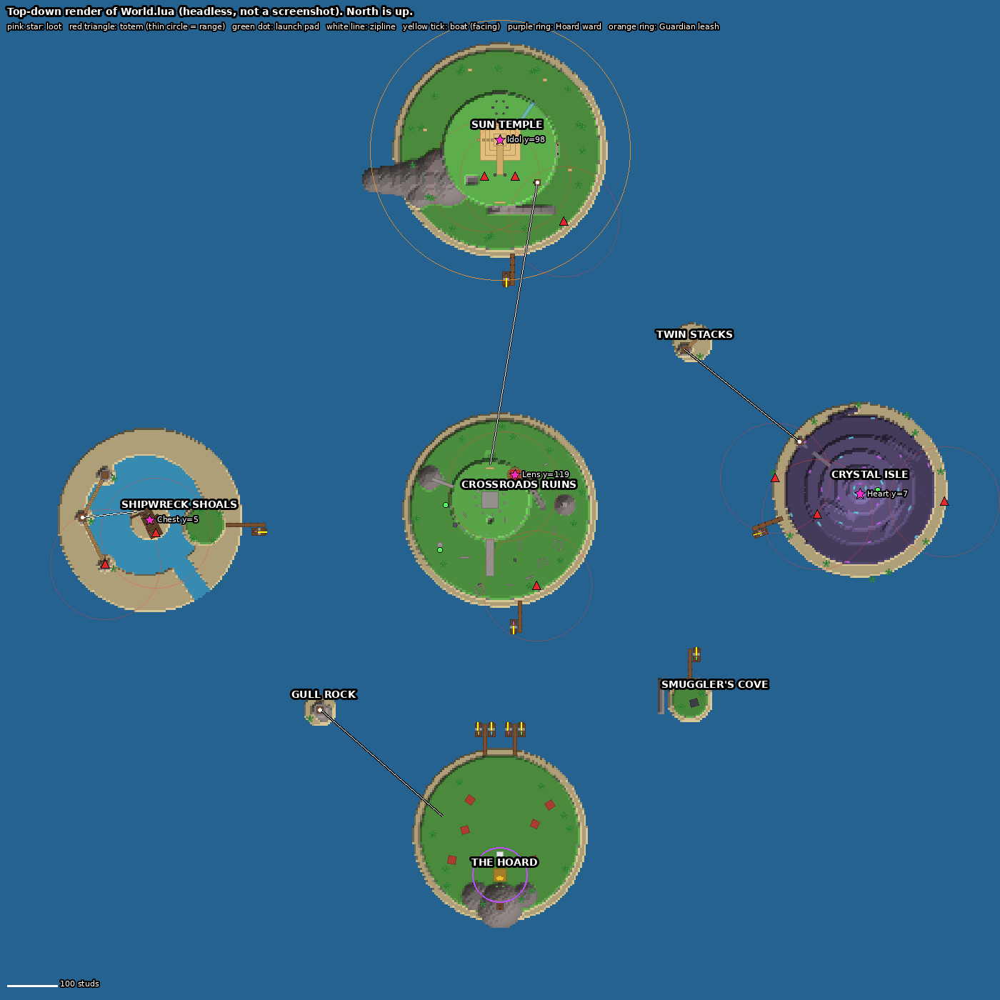
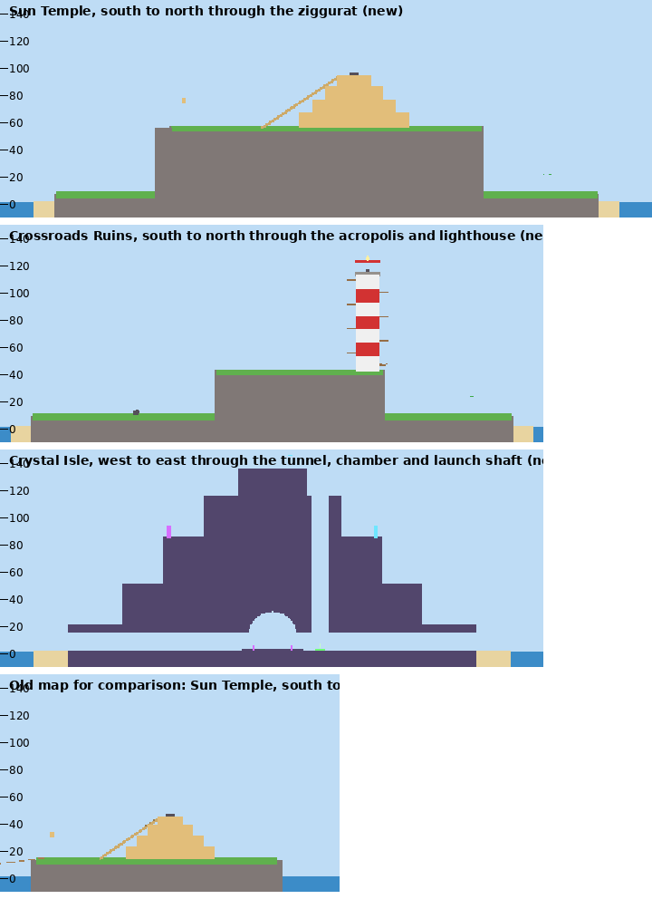

# Report: Sprint, the grapple hook, and a much bigger map

| | |
| --- | --- |
| Date | 2026-10-07 |
| Request | Enrik: add sprinting with stamina, fix the grapple ("shoots a weird beam that does nothing"), and make the map way bigger, more vertical and spread out so boats matter |
| Agent | Claude Code (cloud session, Linux container, no Roblox Studio) |
| Branch | `claude/sprinting-grapple-map-expansion-japzs8` (named by the session), from `origin/main` at `84b762a` |
| Pull request | Not opened yet. Ask the AI to open one when you want review. |
| Merge status | **Not merged.** Waiting for a Studio playtest and explicit approval. |

## 1. Summary

- **Sprint + stamina.** Hold `Shift` to sprint (20 → 29 speed). A full bar lasts 5 s. Run it dry and you're winded until it refills to 35%. Carriers only hustle a little (×1.2). No sprinting in the water or in a seat.
- **The grapple is now a grappling hook.** Aim `F` at a cliff, wall, mast or the ground and it pulls you there. Aim at loose loot or a carrier and it steals, with forgiving aim. Misses cost nothing. Carriers can't use it.
- **The map is about five times bigger and much taller.**
  - The five islands sit ~700 studs apart, with 280–650 studs of open sea between shores, so boats are the way to travel.
  - There are now 9 boats: 4 at home and 1 at every other island's dock.
  - Every island was rebuilt with real vertical routes: cliffs, ramps, ladders, tunnels, a sea cave and ziplines.
  - Three small islets sit between them.

**This session had no Roblox Studio.** Nothing here has been played in Roblox. Section 6 lists what was verified instead, and section 9 is the human checklist.

*Top-down render of `World.lua`'s output, made by running the real world builder headlessly. It is not an in-game screenshot.*

## 2. Why the grapple felt broken

It wasn't crashing. It just almost never did anything:

- `F` only worked if the cursor was **exactly** on loose loot or on a carrier's body, within 55 studs, with clear line of sight.
- Loot is never loose at the start of a raid, and a carrier is a small moving target. So nearly every press hit a wall, the ground or the sky.
- That press drew a yellow line and still **burned the 6 s cooldown**. That's the "weird beam that does nothing."

## 3. What changed

### Sprint and stamina (`Movement.lua`, client `Main`, `Hud.lua`)

- The client only says "Shift is held" (`SprintRequest(held)`). The server decides whether you're really sprinting and owns the stamina meter. That keeps the existing rule that `Movement` is the only writer of WalkSpeed.
- You only sprint while you're moving, on foot, out of the water and have stamina. Standing still with Shift held costs nothing.
- Speed multiplies: carry speed × sprint × water × spirit boost.

| Knob (`Config.lua`) | Value | Effect |
| --- | --- | --- |
| `SPRINT_MULT` | 1.45 | 20 → 29 empty-handed |
| `CARRY_SPRINT_MULT` | 1.2 | Carriers 13–16 → 16–19, still slower than a jogging chaser |
| `STAMINA_DRAIN` | 20/s | A full bar is 5 s of sprinting |
| `STAMINA_REGEN`, `STAMINA_REGEN_DELAY` | 25/s after 0.8 s | Empty to full in about 5 s |
| `STAMINA_RECOVER` | 35 | Winded until it refills this far |

- **HUD.** A "SHIFT SPRINT" slot sits bottom-left, and its fill is your stamina. It turns red with "OUT OF BREATH" when you're winded.
- **Feel.** The camera widens a little (FOV 70 → 78) while sprinting.
- **Gamepad.** Clicking the left stick toggles sprint.
- **Shift lock.** Roblox's shift lock uses the same key, so the server turns it off (`StarterPlayer.EnableMouseLockOption = false`). Tell me if you'd rather sprint on another key and keep shift lock.

### The grapple hook (`Combat.lua`, client `Main`, `Effects.lua`)

The client sends only where it aims: a ray from the camera through the cursor. The server picks what happens:

1. **Steal.** It targets the loot you clicked. Otherwise it picks the loose or carried loot, or its carrier, closest to your aim line, up to 7 studs off.
   - It needs range 60 and nothing solid in between.
   - Success: 6 s cooldown. If the loot just changed hands (steal immunity), it slips off and costs 1 s.
2. **Pull.** Otherwise the server raycasts along your aim up to 130 studs and hooks the first solid thing.
   - Your client reels you in at 95 studs/s. A wall in front of a carrier catches the hook, so cover still protects carriers.
   - At the end you get a small hop up, so a hook on a ledge lifts you over the lip.
   - Jump lets go mid-pull and keeps your swing. If you snag on something, the pull stops.
   - Cooldown 2 s.
3. **Miss.** Sky, too far, or only the sea floor: a faint line for you only, a toast saying why, and **no cooldown**.

Two rules:

- **Carriers can't grapple at all.** Every way home with loot stays a physical journey.
- **Seated players can steal but not pull.** Steals from boat to boat work.

The pull runs on the client, like ziplines and launch pads, because each client moves its own character. The server still chooses the anchor and owns the cooldown. Other players see your rope.

### The map (`World.lua`, plus `Config` bounds and knobs)

| | Old | New |
| --- | --- | --- |
| Footprint | about 430 × 670 studs | about 1,800 × 1,800 studs (2,000 × 2,000 bounds) |
| Main islands, center to center | about 200–250 studs | about 650–720 studs |
| Sea between shores | 20–70 studs, bridged | 280–650 studs, no bridges |
| Highest loot | Lens at y 77 | Lens at y 119, Idol at y 98 |
| Highest walkable point | the Lens perch, about 77 | the Crystal Isle crown, 135 |
| Boats | 2, both at home | 9: 4 at home, 1 at every other island |
| Ziplines / launch pads / ladders | 1 / 2 / 1 | 4 / 3 / 15 |

*Cross-sections from the same headless build: the Sun Temple, the Crossroads, Crystal Isle, and the old temple for scale.*

**Goblin Cove (home).** The Hoard and the hideout hill are where they were, just bigger. There's a lookout on the hilltop, with a crow's nest above it, for scouting light pillars. Two docks on the north shore hold four boats.

**Crossroads Ruins (hub).**

- A lower town (y 10) surrounds the **acropolis**, a cliff-walled plateau (y 42).
- Ways onto the acropolis:
  - grand stairs on the south side
  - a rock ramp up the east side
  - a launch pad at the foot of the west cliff
  - an aqueduct walkway from the west knoll
  - the **undercroft**, a tunnel right under the acropolis with a ladder shaft up into the ruins
- The **lighthouse** stands on the acropolis rim. Its exposed spiral now climbs four turns to the Lens at y 119.
- Also: a watchtower knoll with a ladder, roofless harbor houses for cover, the sniper tower with its pad, and one boat at the south dock.

**Sun Temple (Idol, Guardian).**

- A jungle ring (y 8) surrounds a **mesa** (y 56). The ziggurat on top puts the Idol at y 98.
- Ways up:
  - the pilgrim rock ramp up the south cliff
  - two ladders on the east cliff
  - the **sea cave**: enter at the west waterline under a chain of rocky hills. The tunnel climbs inside the mountain and comes out in the courtyard. The Guardian can't follow you in.
- Ways out:
  - the **Sun Spire zipline**, 572 studs over open sea to the Crossroads acropolis
  - the south dock
  - the cave
- Two totems watch the stairs and one watches the jungle. There's a waterfall off the north-east cliff, for looks.

**Crystal Isle (Heart).**

- A basalt spire of five shelves (y 20, 50, 85, 115, 135). Rock ramps spiral up from shelf to shelf.
- A sea-level tunnel runs through it past the Heart's chamber. Taking the Heart still seals the west half, the side facing home.
- A launch pad in the tunnel shoots you up a shaft onto the 115 shelf.
- **The Leap.** A broken stone bridge off the 85 shelf ends in a **15-stud gap with a 5-stud drop**.
  - Only an empty-handed sprint jump clears it: 18.1 studs. Jogging reaches 12.5, and a sprinting carrier at most 12.0.
  - Beyond it, the Needle has a zipline to Twin Stacks.
  - This replaces the old ridge gap that rejected carriers.
- One boat at the west dock.

**Shipwreck Shoals (Chest).**

- An atoll: wadeable shallows ring a lagoon. A **reef channel** on the south-east lets boats sail into the lagoon, right up to the wreck.
- The wreck is now a three-deck galleon on a sandbank:
  - the Chest in the hold
  - a hole in the hull with a plank up into it
  - ladders between decks
  - two climbable masts with crow's nests
  - the cannon on the stern cabin
- Three sea stacks are linked by rope bridges. A zipline from the tallest drops onto the galleon's deck.
- One boat at the east landing.

**Islets.**

- **Gull Rock:** a ladder up a pinnacle, and a zipline down into Goblin Cove. It's a shortcut home from the Shoals side, but exposed.
- **Smuggler's Cove:** a spare boat, and a rock arch boats can sail under.
- **Twin Stacks:** two stacks and a rope bridge, where the Crystal zipline lands.

**Getting around.** Each island has a big floating name readable from across the sea. Loot tags now show from 3,000 studs.

### Other knobs that changed with the map

| Knob | Old → new | Why |
| --- | --- | --- |
| `RAID_DURATION` | 300 → 360 s | Runs take longer on the bigger map |
| `BOAT_SPEED`, `BOAT_TURN_RATE` | 46 → 62, 80 → 70°/s | Crossing the sea is a 5–10 s boat ride; swimming is 20–45 s |
| `ZIPLINE_SPEED` | 58 → 70 | The temple zipline is 572 studs (about 8 s) |
| `GUARDIAN_LEASH` | 185 → 260 | Covers the bigger temple island |
| `TOTEM_RANGE` | 90 → 110 | Totems sit on bigger islands |
| `BOUNDS_MIN`/`MAX` | ±~400 → ±1,000 | The new map. Each wall stays under Roblox's 2,048-stud part limit |

**The Guardian on cliffs (`Threats.lua`).**

- **Ground ray.** It found the ground with a ray from 25 studs above itself. At the foot of the 48-stud mesa, that ray would start inside the rock. It now casts from the top of the map.
- **Hovering.** It only updated its height while walking, so it could hang in the air at a cliff edge. Its feet now follow the ground every step, and it climbs a bit faster (40 → 60 studs/s).

## 4. Design decisions

1. **The server owns sprint.** A client-side sprint would be smoother, but the server already owns WalkSpeed, and the client reliably overwrites anything else. The FOV widens on the client right away, so the key still feels responsive. The speed change itself arrives one round trip later, the same as carry speed already does.
2. **Carriers sprint, but weakly.** Banning it felt bad, and full sprint would let carriers escape chasers and clear every gap. At ×1.2 a sprinting carrier (16–19) is still slower than a jogging chaser (20). A sprinting chaser (29) closes fast but runs out in 5 s.
3. **Grapple misses are free; carriers can't grapple.** The fix is mostly "it does something useful wherever you aim." Stealing stays line-of-sight and range-limited, so cover and tunnels still protect carriers. The pull is for empty hands only, so it's a hunting and exploring tool, never an escape tool.
4. **No bridges between islands.** Boats are the point. Ziplines are the only fixed links, and they're one-way and exposed. Every island keeps a boat at its dock at the start of each raid. Taking someone's boat, or leaving one where a rival needs it, is part of the game now.
5. **Terrain cliffs and ramps instead of more parts.** Cliffs are cylinder walls players can't walk up. Ramps are thick tilted rock blocks that hug the cliffs. Both came from simple helpers (`mesa`, `cliffRamp`, `rockRamp`, `tunnel`, `ladder`, `dock`, `ropeBridge`), so the islands stay readable in code.
6. **AGENTS.md says "no giant maps before prototype approval."** Enrik explicitly asked for a much bigger map, so I built it. I kept it to one map of about 2 km, with no new loot, systems or progression. If the team thinks this crosses that line, the knobs and `World.lua` are easy to scale back.

## 5. Files

| File | Change |
| --- | --- |
| `src/shared/Config.lua` | Sprint/stamina and grapple knobs; raid length, bounds, boat, zipline, leash and totem numbers for the bigger map |
| `src/server/Movement.lua` | Sprint and stamina |
| `src/server/Net.lua`, `Main.server.lua` | `SprintRequest` remote, stamina refill on spawn, shift lock off, `Movement.tick(dt)` |
| `src/server/Combat.lua` | The grapple: steal with aim assist, pull, miss |
| `src/server/World.lua` | The new map (rewritten) |
| `src/server/Threats.lua` | The Guardian's ground ray and cliff-edge settling |
| `src/server/Boats.lua` | Any number of boats, more flag colors |
| `src/server/Loot.lua` | Loot tag view distance |
| `src/client/Main.client.lua` | Sprint key, grapple aim and pull |
| `src/client/Hud.lua` | Sprint slot, grapple slot text and cooldown, help lines |
| `src/client/Effects.lua` | Sprint FOV, rope visual |
| `README.md`, `docs/AI_CONTEXT.md` | Controls, systems, map |

## 6. Testing performed

There was no Studio, so none of this is a gameplay playtest.

| Check | Result |
| --- | --- |
| StyLua 2.5.2 `--check src`, Selene 0.32.0, Rojo 7.7.1 build, `git diff --check` (the pinned versions `check.ps1` runs) | Pass, 0 warnings |
| luau-lsp 1.70.1 `analyze` with Roblox API definitions and the Rojo sourcemap | 0 errors |
| **Headless world build.** Lune 0.10.4 runs the real `World.lua` and `Boats.lua`, and validates every property, enum and type against the Roblox API. | Builds: 1,188 parts, 99 terrain operations, 9 boats, 4 ziplines, 3 launch pads |
| **Geometry checks** on the recorded build (Python) | All pass. Details below the table. |
| **Headless gameplay simulation.** The real server modules on the real map, with fake players and a fake clock. | 42 of 42 checks pass. Details below the table. |
| **Headless HUD boot.** The real `Hud.lua` builds (every UI property validated) and updates in four states. | The sprint slot reads "hold to run", "sprinting!", "OUT OF BREATH", "hold to run" |
| Map render and side views | The two images above |

**Geometry checks:**

- **Boats:** all 9 are moored in open water with a clear path ahead.
- **Ziplines:** none of the 4 pass through terrain or solid parts, and each start and end is 6–9 studs above a floor.
- **Spawns and loot:** every spawn point and loot spot is in open air with a floor under it.
- **Totems and ladders:** every totem stands on ground, and every ladder top meets a floor.
- **Ramps:** all 7 terrain ramps are 20–31°, have no step over 0.52 studs and have clear headroom. Each one's top connects flat onto its shelf.
- **Tunnels:** all 4 have a floor and 6 studs of headroom the whole way.
- **Launch pads:** each one's apex clears its target ledge by 11–13 studs.
- **The Leap:** jog and carrier jumps fall short; an empty sprint jump clears it.

**Gameplay simulation:**

- **Sprint:** speed is 29; stamina drains at 20/s; you're winded at 0; there's no regen during the 0.8 s delay; you recover at 35; and the bar refills fully. There's no sprint while standing still or in water, and a sprinting Lens carrier runs at 19.
- **Grapple:**
  - A hook on the temple cliff lands at the rim. The ramp in the way catches the hook.
  - Sky, out-of-range and sea-floor aims are misses with no cooldown, and only the thrower sees them.
  - A steal during immunity slips off (1 s). Aiming 3 studs beside a carrier steals the loot (6 s).
  - A carrier can't grapple. A wall between thief and carrier turns the steal into a pull onto the wall.
- **Bank:** banking the Lens gives +3 gold.
- **Guardian:** stealing the Idol wakes it. It follows the carrier off the mesa down to the jungle (no longer hovering at the cliff edge) and smashes the idol loose. It sank more than 3 studs into the ground in only 3 of 750 frames, while stepping up a ziggurat tier.
- **Boat:** driven north from home, it crosses the sea and stops at the Crossroads beach.

The harness (about 1,000 lines of Lune and Python) is **not in this PR**. Lune is a new tool, and `AGENTS.md` asks for approval first. I can add it under a tools folder if the team wants headless checks in cloud sessions. It also found two Lune quirks worth knowing: `CFrame.lookAt` returns wrong rotations in Lune 0.10.4, and Lune has no live `Part.Position`.

## 7. What remains untested

Everything that needs the real engine, the network or people:

- **Sprint feel.** The speed arrives one round trip after the key press. Check that it doesn't feel laggy on a real server, that the FOV change isn't too much, and that turning shift lock off doesn't annoy anyone.
- **The grapple pull, all real physics.**
  - The `LinearVelocity` pull, the ease-in near the end and the pop over ledges.
  - Snag detection against walls, and the jump release.
  - What other players see.
  - Pulling onto moving boats.
- **Terrain at 4-stud voxels.** The renders use exact shapes. In Roblox, cylinder cliffs, ramp edges and tunnel mouths are smoothed. Check:
  - every ramp is walkable where it meets the cliff
  - the sea cave's slope feels fine
  - the undercroft and Crystal shafts are wide enough after smoothing
  - no cliff face is walkable by accident (Humanoid `MaxSlopeAngle` is 89°)
- **Long ziplines.** 572 studs at 70 studs/s, with one CFrame per frame. Check that riders aren't jittery for others.
- **The launch shaft.** Air-steering out of the Crystal shaft onto the 115 shelf at about 218 studs/s up.
- **Boats.**
  - Entering the Shoals lagoon through the reef channel.
  - Docking beside the new docks.
  - The Smuggler's Cove arch.
  - Boats in the far corners of the bounds.
- **Performance.** Terrain building time on server start (about 99 operations, much bigger volumes than before), water rendering over a 2 km sea, and frame rate on weaker machines.
- **Fun and balance.** Map size versus 3 players and a 6-minute raid, travel time versus action, whether boats get fought over, Heat over longer carries, and every new number.

## 8. Known issues and risks

- **The map might be too big for 3 players.** If raids feel empty, the quickest knobs are:
  - pull the island centers in (`HOME`, `TEMPLE`, `CRYSTAL`, `SHOALS` at the top of `World.lua`)
  - raise `BOAT_SPEED`
  - shorten `RAID_DURATION`
- **Respawning is costly.** You respawn at home, which is now a boat ride from everything. That's a real penalty for dying.
- **The Guardian is still kinematic.** It walks through walls and cliffs, and steps up the ziggurat tiers by clipping into them for a moment.
- **Grapple hooks can't catch water.** The hook passes through it to the sea floor and misses.
- **Shift lock is off for everyone.**
- **Boats pass through dock posts.** Visual only, as before.

## 9. Human playtest checklist

**Solo Studio pass first** (an AI session with Studio MCP, or a human, about 20 minutes):

1. Press Play. The console should stay empty, and the world takes a moment longer to build than before. The HUD shows the new **SHIFT SPRINT** slot bottom-left.
2. Hold Shift and run: faster, wider view, the bar drains. Run it dry and you see **OUT OF BREATH**; wait and it comes back. Try Shift in the water (no sprint).
3. Press `F` at the sky (a toast, no cooldown), at a wall (pulled to it), at a cliff top (pulled up and over the edge), mid-pull with jump (let go).
4. Take a boat from home to each island. Does the sea crossing feel like a journey, and does the boat stop nicely at each beach and dock? Sail into the Shoals lagoon through the reef channel.
5. **Crossroads:** climb the grand stairs, the east ramp, the aqueduct and the undercroft ladder. Take the Lens and jump off.
6. **Sun Temple:** come in through the sea cave. Take the Idol and escape three ways: the stairs and pilgrim ramp, the Sun Spire zipline, and the cave.
7. **Crystal Isle:** take the Heart, then use the launch pad up the shaft. Walk the ramps between shelves. Try the Leap empty-handed with a sprint, then while carrying (you should fall short).
8. **Shoals:** use the wreck zipline from the sea stacks. Climb the masts. Take the Chest and boat out through the channel.
9. Ride the Gull Rock zipline home.

**Then the 3-player test** (Test > Server & Clients > 3 players):

- [ ] Grapple-steal from a carrier in the open, near-miss aim included
- [ ] A carrier behind a wall is safe from grapple steals
- [ ] Sprinting chasers catch jogging carriers, but stamina runs out
- [ ] Boats get stolen, fought over or left stranded
- [ ] Ropes and pulls look right to other players
- [ ] Is the map too big, about right, or still too small for 3 players and 6 minutes?
- [ ] KILL / RE-PROTOTYPE / GREENLIGHT after several raids

## 10. Branch, commits, status

- Branch `claude/sprinting-grapple-map-expansion-japzs8`, from `origin/main` `84b762a`, with a clean working tree at the start. The session named the branch; it doesn't follow `AGENTS.md`'s `feature/<task>` style.
- Pushes are normal: no force-push, no history rewrite.
- **No PR yet, and not merged.** Per `AGENTS.md`, merging waits for a human playtest and explicit approval.
